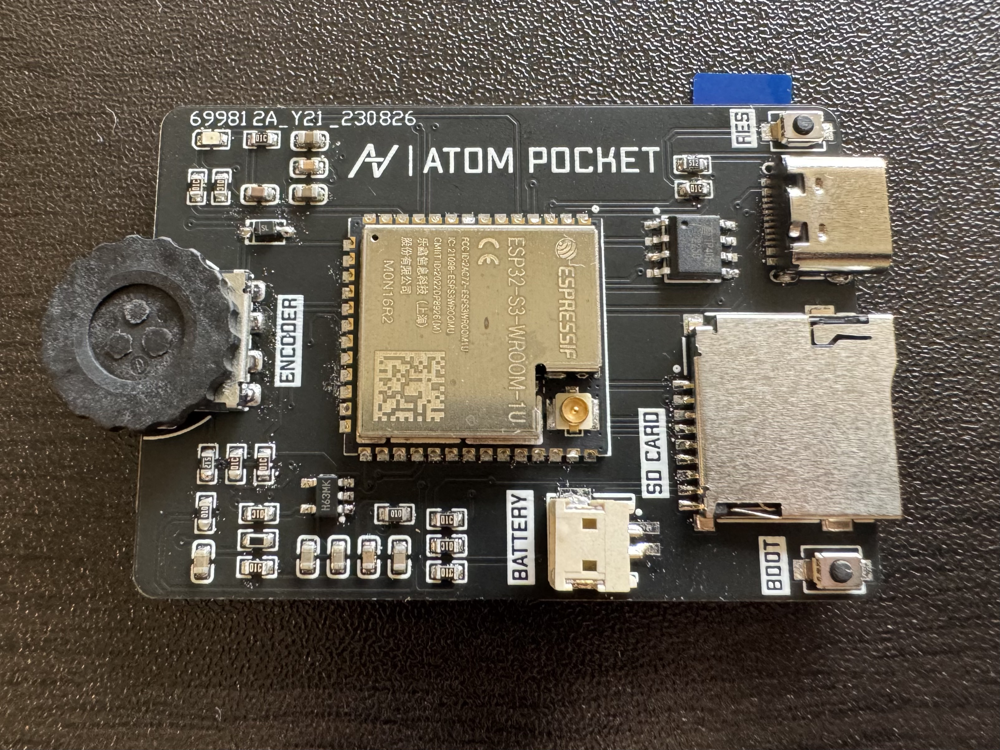
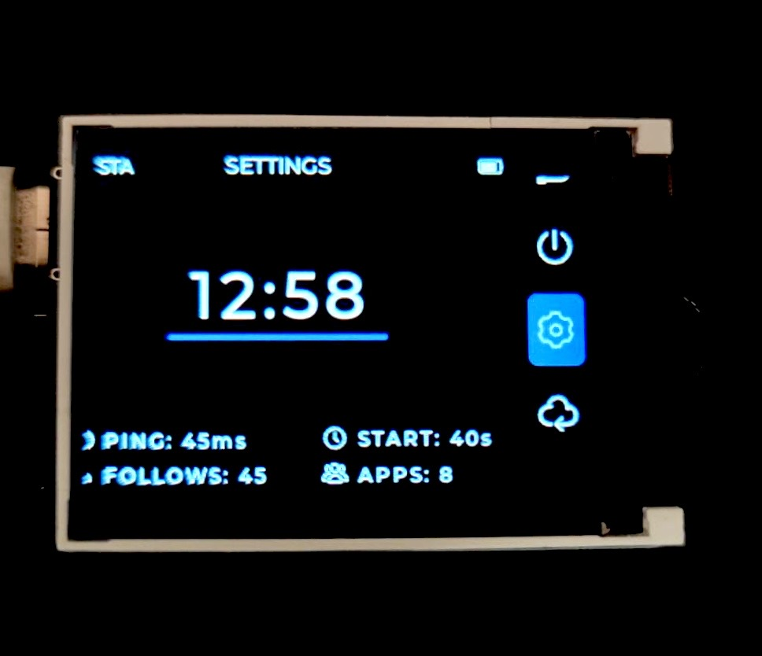

# ATOM POCKET

一个基于 ESP32 + LVGL 的轻量级移动终端
<!-- PROJECT LOGO -->
<br />

<p align="center">
  <a href="https://github.com/HanRabbit/AtomUI/">
    
  </a>

  <h3 align="center">ATOM UI</h3>
  <p align="center">
    一个基于 ESP32 + LVGL 的轻量级 UI 框架
    <br />
    <a href="https://github.com/shaojintian/Best_README_template"><strong>探索本项目的文档 »</strong></a>
    <br />
    <br />
    <a href="https://github.com/shaojintian/Best_README_template">查看Demo</a>
    ·
    <a href="https://github.com/shaojintian/Best_README_template/issues">报告Bug</a>
    ·
    <a href="https://github.com/shaojintian/Best_README_template/issues">提出新特性</a>
  </p>

</p>

## 目录

- [上手指南](#上手指南)
  - [开发前的配置要求](#开发前的配置要求)
  - [安装步骤](#安装步骤)
- [文件目录说明](#文件目录说明)
- [开发的架构](#开发的架构)
- [部署](#部署)
- [使用到的框架](#使用到的框架)
- [贡献者](#贡献者)
  - [如何参与开源项目](#如何参与开源项目)
- [版本控制](#版本控制)
- [作者](#作者)
- [鸣谢](#鸣谢)

## 项目图片



### 上手指南

Atom UI 框架基于 PlatformIO 架构编写，硬件基于 ESP32-S3 + LVGL 9.1 的 ATOM POCKET 开发平台

###### 开发前的配置要求

1. 为了顺利运行 ATOM UI 的项目编译，你的电脑需要满足以下最低配置：
- 操作系统
支持的操作系统包括：
 Windows
 Linux
 macOS

 - 处理器（CPU）
 最低要求：单核 1.6 GHz 或更高。
  推荐配置：多核 CPU（4 核或以上），以提高编译和运行效率。

 - 内存（RAM）
 最低要求：2 GB RAM。
  推荐配置：4 GB 或更高。

 - 磁盘空间
 至少需要 10 GB 的可用磁盘空间用于存储项目文件和构建产物。
  如果你计划使用 LVGL 的图形界面功能，可能还需要额外的空间来存储字体、图标和其他资源文件。

 - 开发工具
 安装 PlatformIO 或 VS Code（推荐）。
  需要安装 Python 3.5+（通常由 PlatformIO 自动管理）。
  如果需要使用特定的编译器（如 GCC），请确保已安装相应的开发工具链。

2. 对 MCU 的要求
LVGL 是一个图形库，主要用于嵌入式系统中。为了运行 LVGL 应用程序，你的微控制器需要满足以下配置：
- 处理器（CPU）
 推荐使用 32 位 ARM Cortex-M 系列处理器。
  常见的开发板包括：
  STM32 系列（如 STM32F4、STM32L4）
  ESP32
  其他支持 FreeRTOS 或实时操作系统的 MCU。

 - 内存（RAM）
 LVGL 对 RAM 的要求较高，具体取决于你使用的功能和分辨率。
  最低要求：64 KB RAM。
  推荐配置：128 KB 或更高，以确保 LVGL 能够流畅运行复杂的图形界面。
 - 闪存（Flash）
 用于存储应用程序代码、LVGL 库文件和其他资源。
  最低要求：256 KB Flash。
  推荐配置：512 KB 或更高，尤其是当你需要添加更多功能或图形资源时。
 - 显示屏接口
 LVGL 支持多种显示屏接口，包括：
  SPI（Serial Peripheral Interface）
  并行 LCD 接口
  HDMI（适用于高性能 MCU）。
  确保你的开发板支持所需的显示屏分辨率和接口类型。
 - 电源管理
 如果你使用电池供电的设备，请注意 MCU 和 LVGL 的功耗要求，尤其是在图形渲染时。

###### **安装步骤**

1. 配置好 PlatformIO 的开发环境
2. Clone the repo

```sh
git clone https://github.com/HanRabbit/AtomUI.git
```

### 文件目录说明

```
filetree 
├── include
│   └── README
├── lib
│   └── README
├── platformio.ini
├── src
│   ├── Common
│   │   ├── Common.cpp
│   │   ├── Common.h
│   │   ├── FileManager
│   │   │   ├── FileManager.cpp
│   │   │   └── FileManager.h
│   │   ├── Log
│   │   │   ├── Log.cpp
│   │   │   └── Log.h
│   │   ├── MessageManager
│   │   │   ├── Account.cpp
│   │   │   ├── Account.h
│   │   │   ├── MessagePool.cpp
│   │   │   └── MessagePool.h
│   │   ├── Time
│   │   │   ├── Time.cpp
│   │   │   └── Time.h
│   │   ├── TimerManager
│   │   │   ├── TimerManager.cpp
│   │   │   └── TimerManager.h
│   │   └── WiFi
│   │       ├── WiFi.cpp
│   │       └── WiFi.h
│   ├── Drivers
│   │   ├── Battery
│   │   │   ├── Battery.cpp
│   │   │   └── Battery.h
│   │   ├── Display
│   │   │   ├── Display.cpp
│   │   │   ├── Display.h
│   │   │   └── TFT_backlight
│   │   │       ├── TFT_backlight.cpp
│   │   │       └── TFT_backlight.h
│   │   ├── Drivers.cpp
│   │   ├── Drivers.h
│   │   ├── Encoder
│   │   │   ├── Encoder.cpp
│   │   │   └── Encoder.h
│   │   ├── IO_Map
│   │   │   └── IO_map.h
│   │   ├── SD_Card
│   │   │   ├── SD_Card.cpp
│   │   │   └── SD_Card.h
│   │   └── System
│   │       ├── System.cpp
│   │       └── System.h
│   ├── UI
│   │   ├── Apps
│   │   │   ├── Apps.cpp
│   │   │   ├── Apps.h
│   │   │   ├── HomeApps.cpp
│   │   │   └── HomeApps.h
│   │   ├── Res
│   │   │   ├── Components
│   │   │   │   ├── SideBar
│   │   │   │   │   ├── SideBar.cpp
│   │   │   │   │   └── SideBar.h
│   │   │   │   └── StatusBar
│   │   │   │       ├── StatusBar.cpp
│   │   │   │       └── StatusBar.h
│   │   │   ├── Pages
│   │   │   │   ├── HomePage
│   │   │   │   │   ├── HomePage.cpp
│   │   │   │   │   ├── HomePage.h
│   │   │   │   │   ├── view.cpp
│   │   │   │   │   └── view.h
│   │   │   │   ├── LaunchPage
│   │   │   │   │   ├── LaunchPage.cpp
│   │   │   │   │   └── LaunchPage.h
│   │   │   │   ├── LoadingPage
│   │   │   │   │   ├── LoadingPage.cpp
│   │   │   │   │   └── LoadingPage.h
│   │   │   │   ├── Pages.cpp
│   │   │   │   ├── Pages.h
│   │   │   │   └── TestPage
│   │   │   │       ├── TestPage.cpp
│   │   │   │       └── TestPage.h
│   │   │   └── ResourcePool
│   │   │       ├── ResourcePool.h
│   │   │       └── img
│   │   ├── Themes
│   │   │   ├── Themes.cpp
│   │   │   └── Themes.h
│   │   └── Utils
│   │       ├── PageManager
│   │       │   ├── PageManager.cpp
│   │       │   └── PageManager.h
│   │       └── UIGroup
│   │           ├── UIGroup.cpp
│   │           └── UIGroup.h
│   └── main.cpp
└── test
    └── README

```


### 开发的架构 

请阅读[ARCHITECTURE.md](https://github.com/shaojintian/Best_README_template/blob/master/ARCHITECTURE.md) 查阅为该项目的架构。

### 部署

暂无

### 使用到的框架

- [PlatformIO](https://github.com/platformio/platformio-core)
- [LVGL 9](https://github.com/lvgl/lvgl)

### 贡献者

- [HanRabbit](https://github.com/HanRabbit)

#### 如何参与开源项目

贡献使开源社区成为一个学习、激励和创造的绝佳场所。你所作的任何贡献都是**非常感谢**的。


1. Fork the Project
2. Create your Feature Branch (`git checkout -b feature/AmazingFeature`)
3. Commit your Changes (`git commit -m 'Add some AmazingFeature'`)
4. Push to the Branch (`git push origin feature/AmazingFeature`)
5. Open a Pull Request


### 版本控制

该项目使用Git进行版本管理。您可以在repository参看当前可用版本。

### 作者

田梓涵@HanRabbit

- [Bilibili](https://space.bilibili.com/385995212)
- [Github](https://github.com/HanRabbit)
- [CSDN](https://blog.csdn.net/Han_Rabbit?type=blog)

 *您也可以在贡献者名单中参看所有参与该项目的开发者。*

### 版权说明

该项目签署了MIT 授权许可，详情请参阅 [LICENSE.txt]
